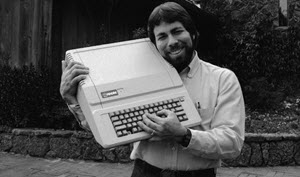
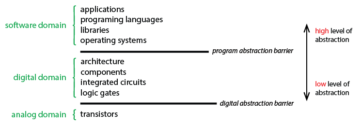
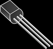
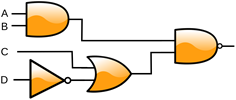

# Abstraction and the Parts of a Computer

## Components of a computer system<sup><small>[1.2.1](../resources/syllabus.md#121)</small></sup>

The physical objects of the computer itself that can be touched or manipulated are called the **hardware**:star: of a computer. These include things like processors, memory chips, motherboards, power supplies, and so on.

If a piece of hardware is separate from the computer itself, it might be called a **peripheral**:star: of the computer. This will include things like monitors, keyboards, mice, speakers, and so on. The boundary between a peripheral and hardware can be fuzzy, especially in the case of connected computers like laptops or even mobile phones.

The physical objects are made to *do* things through the aid of **software**:star: - the sets of commands and rules that allow us to make a computer work. Software ranges from very simple instructions to do things like "add two numbers" all the way up to giant applications like Microsoft Word or Fortnite.

If you connect more than one computer together, you get something called a **network**:star:. We will learn much, much more about networks in a later section of these notes.

And of course, any computer system depends on humans to keep it running and useful. You can call those people the **human resources**:star: of the system.

## Using abstraction to manage complexity

  
<small>Steve Wozniak with an Apple II.  
Image Credit: [TechCrunch](https://techcrunch.com/2014/11/04/nearly-40-years-later-steve-wozniak-still-brainstorms-ways-the-apple-ii-could-have-been-better/)</small>
{: .image-right}

The “Computer Guy” who knows everything about computers does not really exist anymore. Perhaps the last person to completely design and create all of the hardware and software for a commercially viable computer, the Apple II, was Steve Wozniak in 1977, and even he had to use circuit boards that were made in lab by IBM or another electronics company. Today, information technology professionals work within areas of expertise because now there is simply too much hardware and software technology for any one person to master it all. At some point everyone must depend on some computer hardware and/or software to work, without knowing how it works. How it works is left as an **abstraction**:star:. As such, people working in computer science fields must be comfortable working with various levels of abstraction so they can focus more fully on their assigned tasks.

Let's explore the layers of abstraction for just one part of the computer; the "brain", or computer processor. 

## One Important Abstraction Tower - The Central Processing Unit

The *central processing unit* (CPU), or processor, is the "brain" of the computer - the part of computer that does all of the calculations and "work" of the software. It doesn't do much by itself - it needs other hardware to interact with - but it is arguably the key component that makes something a digital computer.

Most people who work with or even write software do not interact directly with the processor - instead, they interact through many, many layers of abstraction. Let's explore some of those layers.

  
<small>Image Credit: [The Beauty and Joy of Computing, Berkeley](https://bjc.edc.org/bjc-r/cur/programming/6-computers/1-abstraction/01-abstraction.html)</small>

### ---- The Hardware Layer ----

#### Level 1 - Transistors

{: .image-right}
Computer processors, at their core, are made up of trillions of tiny circuits called *transistors,* as well as other circuits that hold data called *memory* (specifically, at this level, they are called *CPU registers*). The people who design transistors and memory themselves are basically physicists or electrical enginers - at that level, computer science is essentially physics! We will learn more about the details of how memory and transistors communicate in a later unit.
{: .clearfix} 

#### Level 2 - Logic Gates

{: .image-right}
The transistors are typically combined in groups of two or three into small circuits called *logic gates*. These logic gates allow circuit designers to forget about the electricity itself, and instead think about the flow of data. We will learn more about logic gates, and the math that surrounds them, in a later unit.

Even though logic gates are built directly in hardware, we tend to THINK of them as purely theoretical objects.
{: .clearfix}

#### Level 3 - Fundamental Operations
 
Individual logic gates are then combined into larger, combined circuits that do more complicated things, such as add two numbers or read data from memory. These larger circuit build the **fundamental operations**:star:<sup><small>[4.3.1](../resources/syllabus.md#431)</small></sup> of a computer processor, and are usually hardwired directly into the computer processor. People who think about how these logic gates should be combined in a given computer, and how many of each type of circuit to make, and how to wire them together, are called microprocessor designers or processor engineers. The most important and common fundamental operations include *adding two numbers*, *comparing two numbers*, *retrieving data from memory*, and *storing data into memory*.

#### Level 4 - Processing Units

Logic gates and fundamental operaions are combined in clever ways into *units* that serve different roles. Different processors will create and combine these units in different ways, and give different powers to each unit, but there are some units that appear in nearly all processors. An **Arithmetic Logic Unit (ALU)**:star:<sup><small>[2.1.1](../resources/syllabus.md#211)</small></sup> performs logical operations and mathematical operations on integers while a **Control Unit (CU)**:star:<sup><small>[2.1.1](../resources/syllabus.md#211)</small></sup> provides instructions to the ALU, memory, and outputs. Advanced processors may include more than one of each of these, or other specialized processor units such as an *floating point unit*. 

### --- The Software Layer ---

#### Level 5 - Machine / Assembly language

Humans tell the control unit what to do by sending a signal to it in *machine language* (a direct stream of carefully configured `0`'s and `1`'s) or, much more commonly, *assembly language* (a slightly more human-readable way of writing these signals) that is then turned by a computer into machine language. Below is a short example of an assembly program that adds 3 and 4 and prints the result (you do NOT need to understand this completely or be able to reproduce it!)

```nasm
_start:             ; tell the control unit we are starting a program

mov     eax, 3  	; store the number 3 in register a
mov     ebx, 4		; store the number 4 in register b
add     eax, ebx    ; add the stored 3 and 4 and put the result (7) in a spot of memory called register a
add     eax, '0'	; by adding the character '0', the 7 turns into printable '7'

mov     ecx, eax	; put the '7' into register c
mov     edx, 1		; put the length of the message, 1, into register d
mov     ebx, 1      ; put 1 into ebx. This sends a signal that we will want to print on the screen, not elsewhere.
mov     eax, 4      ; put 4 into eax. This tells the processor we want to actually write something.
int     0x80        ; tell the processor to do its thing.
```

Though more readable than machine language, assembly is clearly very hard to understand, and requires that the person writing the code be intimately familiar with the specific computer processor being used. Most people who write in assembly regularly would probably consider themselves to be *computer engineers*, and they write things like operating systems, compilers, and hardware drivers. We will NOT be using any assembly language this course.

#### Level 6 and higher - Higher Level programming

High level *Programming Languages* can be used to abstract the machine language used for sending instructions to computers into a more readable, almost human language. For example, in the language `C`, one of the first high level computer programming languages to gain popularity, the same program as above might be written:

```c
#include <stdio.h>
int main()
{
	int a = 3;
	int b = 4;
	printf("%d" , a + b);
	return 0;
}
```

And in the even simpler, even MORE abstracted language of Python, might simply be:

```Python
a = 3, b = 4
print a + b
```

People who work using languages like these are called *computer programmers* or *software developers*. While developing software in these languages, programmers themselves often add even MORE layers of abstraction. We will spend a large portion of this class working on learning how to write and solve problems using these high-level languages.

## Conclusions

The previous exercise doesn't even get into the many OTHER layers of abstraction inherent in working with modern computers. Input devices (keyboards, mice, gamepads), output devices (screens, printers, speakers), and storage devices (hard disks, SD cards, CDs) are ALL necessary for a computer to be useful, and every one of them has multiple layers of abstraction between their physical operation and how a computer programmer might use them.

**Computer Science** concerns itself with all of these layers, but focuses on the abstract over the physical. At the end of this course, you will NOT be ready to get a job as a software developer, nor as an engineer. That takes on-the-job training and a level of specificity this course won't be able to give you. But you'll have a basic understanding of the entire scope of how computers work and communicate, and the beginnings of an ability to mold them to your desires. 

Let's get to it.

# Study Materials

Every reading will include a section like this at the end, with suggestions for things to make to study later. Regularly returning to this content will enable you to remember for a long time - two years!

## Questions (check your understanding)

1. What is the name of the basic electonic component from which all processing power is built?
   <details><summary>click to expand answer</summary>
   Transistor
   </details>

2. **(November 2017, problem 2)** Two of the fundamental operations of a computer are *add* (two values) and *retrieve* (values from memory). What are two other fundamental operations?
   
   <details markdown="1"><summary>Click to expand answer</summary>
   1. Compare (two values)
   2. Store (values back into memory)

   The IB also accepts many other words or idea but most of them are related to these, so lets keep it simple.
   </details>


## Flashcards

{: .image-right}
Make flash cards OR a deck on [http://quizlet.com](http://quizlet.com) for the following terms from this introduction. On the back, write a 2-3 bullet point summary. This is NOT a definition - write whatever you know, using the term on the front as a key term for recall. We will return to some of these terms later, and you can add more bullet points then.

* hardware
* software
* peripheral
* network
* human resources
* abstraction
* transistors
* fundamental operations
* processor units
* Arithemetic Logic Unit
* Control Unit
* machine language
* assembly language
* programming language

