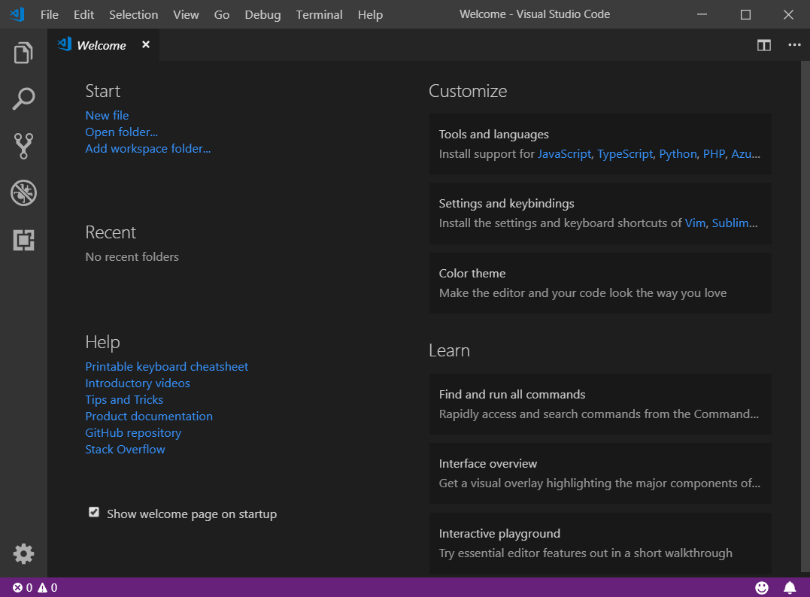

# Welcome!
## Let's install (and learn about) some software!

If there is one thing that is true about writing your own computer software - a major element of this course and our focus for the first semester - it is that it takes software to make software. 

Part of my goal as a teacher is to get you comfortable with the way *real computer programmers* use software to make software; that starts today.

Today we will do FOUR major software things. Click each link, follow the instructions, then click back to get back here.
1. [Open and practice with the *command line*](commandline.md)
2. [Install a *package manager*](packagemanager.md)
3. [Install Visual Studio Code](visualstudiocode.md)


### Installing our Text Editor / IDE

A text editor is a program whose primary purpose is editing files that consist only of words and numbers. Computer programs are made entirely out of these text files! A text editor plus the command line is all you need to write computer software, but sometimes it is nice to have more options.

An IDE, or "integrated development environment" can edit text, just like a text editor, but it also comes with built-in tools to run programs, find problems in programs, sometimes even make graphical user interfaces. They tend to be much fancier and more complicated, but also more powerful. They are often designed for a specific programming language. We will use one of these, later in the course, called Netbeans for Java.

For the beginning of this course, we will use a program called [Visual Studio Code](https://code.visualstudio.com) to write our software. This calls itself a text editor, but really, it's somewhere in the middle, thanks to lots of support for plugins that make it more powerful. You can install it from the website (and probably the Mac store) but lets test out our new tools!

* Mac Users! Type
`brew cask install visual-studio-code` and press enter. 

* Windows Users! Type `choco install vscode` and press enter.

If all goes well, it should download and install the program which will then be on your system (watch for questions or problems though). When it is installed, go ahead and open it - you should see something like this:



On that screen, go ahead and click the two links in the upper right that say "Install support for Javascript" and "TypeScript". We will be using both of those soon, and getting the support installed is a great idea!

### Installing important command-line software

We also need to install some programs that will run on our command-line, and will allow us to do some powerful programming using the language TypeScript.

#### Installing NodeJS, npm, and typescript

npm is a package manager specifically for programmers who use javascript or typescript to program. It runs on top of a sevice called nodejs, and we need it to get typescript going!

First, install, nodejs. this will also install npm.

On your command line type (not the part after the #)
```bash
brew install nodejs # mac users
choco install nodejs # windows users
```
Next install typescript using npm.

```bash
npm install -g typescript
```


